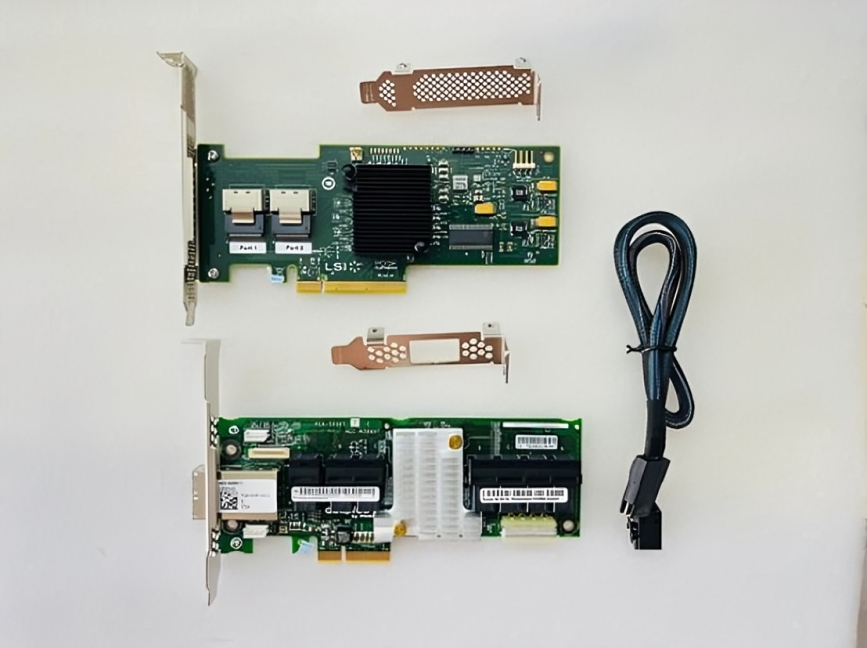
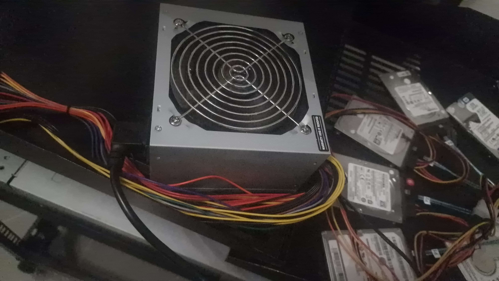
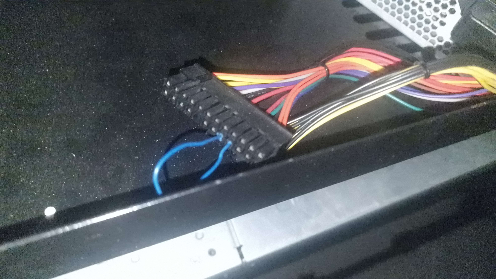
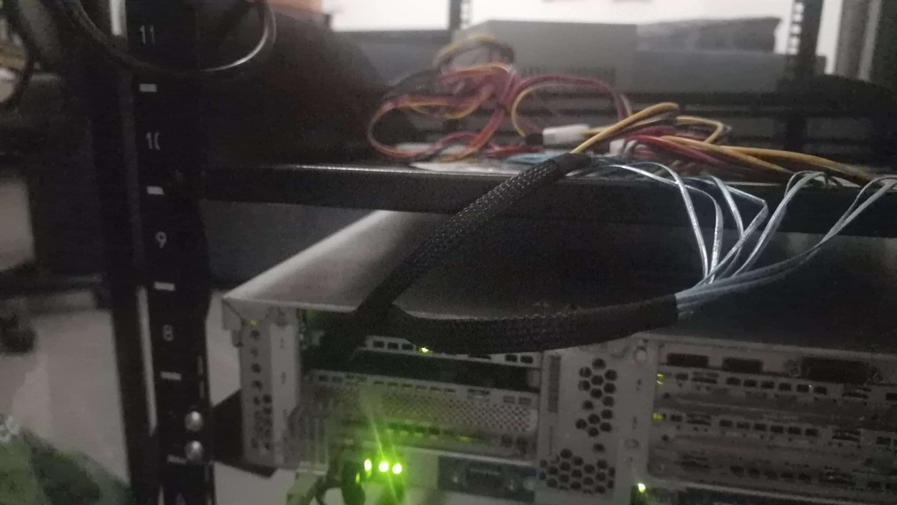
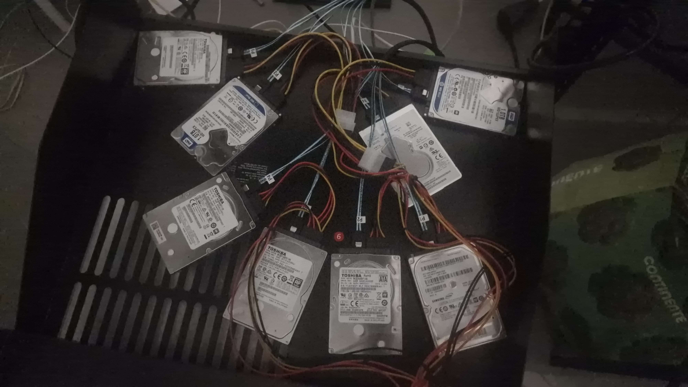

<!-- photo: overview shot of the full setup — server, external PSU, disks on top -->

My home server runs a Jellyfin instance, Frigate for the CCTV cameras around the house, and a bunch of other general self-hosted stuff. It's been quietly filling up for a while, and eventually I hit the obvious wall: no more free drive bays. Buying a new chassis or a proper JBOD enclosure would have fixed it instantly, but also would have cost a lot more than I wanted to spend. This is all in the name of saving money (the whole point of a homelab), for me, is squeezing more out of what I already have instead of throwing money at a clean solution.

So the plan was: find a way to attach more disks without any slots, without buying new hardware I didn't strictly need.

## The Card

I picked up an **LSI 9211-8i**, already flashed to IT mode, plus an **Adaptec AEC-82885T 36-port expansion card**. The LSI card alone gives me 8 SAS/SATA lanes through its two Mini-SAS (SFF-8087) ports, more than enough for what I need right now. I'm not actually using the Adaptec expander yet; I bought it because it was available and cheap at the time, and it'll let me scale up to way more disks later if I ever need to, but for this round it's just sitting in the box.

## The Actual Problem: Power

Having a controller card solves the data side. It says nothing about where the disks physically live or how they get power, and that's where things got annoying. My case has zero free bays, so there was no "just screw them in and plug into the existing PSU" option. I didn't know exactly how I was going to power eight extra drives that don't belong to any bay, and for a while that was the whole blocker.

The solution I landed on: a separate PSU, dedicated entirely to the extra disks.

A standalone ATX PSU won't turn on by itself, though it expects a motherboard to tell it to power up. The standard trick is to bridge the PS_ON pin to a ground pin on the main 24-pin connector, which tricks the PSU into thinking it's connected to a board that just told it to switch on. On most PSUs that's the 4th and 5th pins of the connector (counting along the row), a small paperclip or wire jumper across those two does it. I used a clip for exactly this, and once it's bridged, the PSU powers on as soon as it gets AC, no motherboard involved.

From there, I needed to get actual power out to eight drives. I picked up some **SATA power splitter/extension cables**, that break a single PSU power lead into multiple SATA power connectors, since one PSU rail obviously isn't going to run eight drives off a single connector on its own.

## Wiring It Up

For the data side, I'm using **Mini-SAS (SFF-8087) to 4x SATA forward breakout cables**, two of them, one per port on the LSI card, giving me the full 8 lanes. These are data-only cables, which is worth being explicit about: they carry the SAS/SATA signal from the card to each drive, but they don't carry any power. Power and data are two completely separate paths here, hence the separate PSU and separate splitter cables above.

Rather than running the breakout cables straight to each drive, I'm routing them through my server's backplane, the same backplane the internal bays use, which saves me from having eight loose SATA data cables flopping around inside the case.

The disks themselves are, for now, just sitting on top of the server case. I'm fully aware that's not where they should end up long-term, no proper airflow, no real mounting, not exactly tidy, but it works, and it gets me the extra capacity today. Sorting out a proper mounting solution (probably a cheap 3D-printed bracket or a repurposed drive cage) is on the list for later.

## The Result

With the LSI card, the external PSU, and the backplane routing, I've got room for 8 extra disks on a server that technically has no free slots for them. It's not elegant, but it didn't cost anywhere near what a new chassis or a dedicated storage enclosure would have, and it means the Jellyfin library and the Frigate footage retention both get to keep growing instead of hitting a wall.

If I ever actually need more than 8 extra drives, the Adaptec expander is already sitting there waiting to be plugged in. For now, though, this covers it.