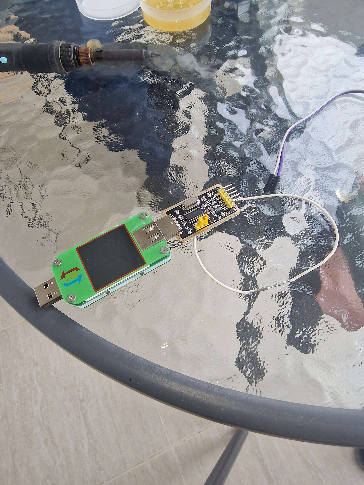
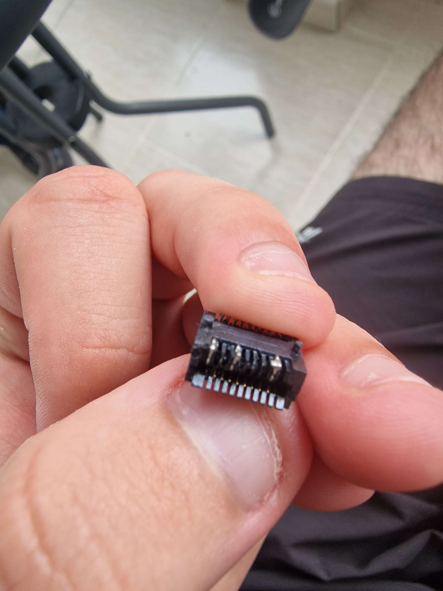
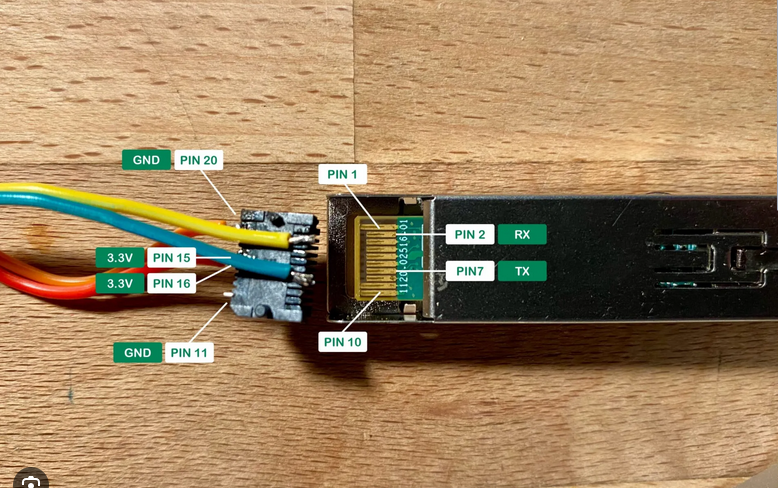
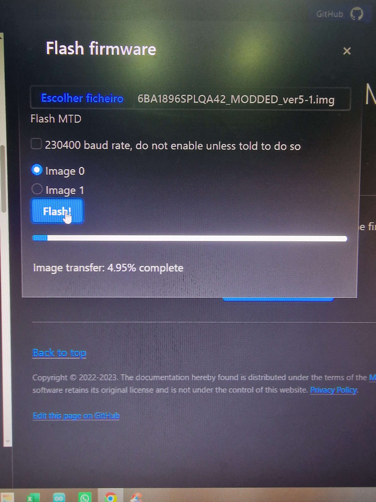
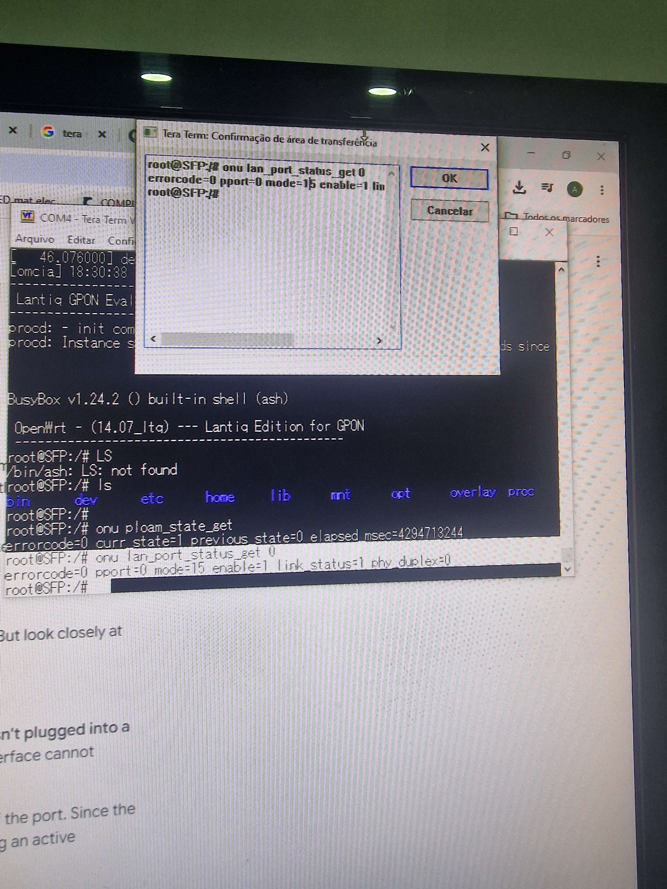
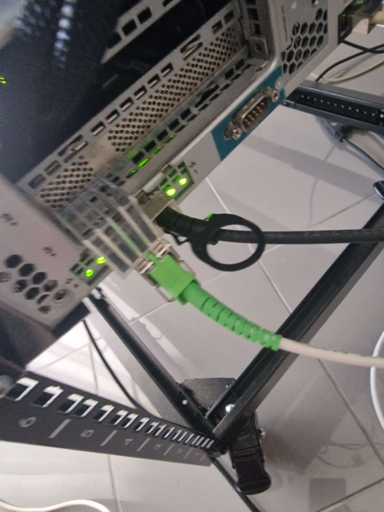

This post comes before the one about [replacing my ISP router](/posts/router/router), chronologically. Before I could plug anything into OPNsense, I first had to get a GPON stick into a state where it would actually boot and talk to my ISP's network. That part did not go smoothly.

## What's a GPON Stick, and Why Bother

A GPON stick, in this context, is a small SFP module that plugs into a normal SFP cage on a switch, router, or NIC, and terminates the fiber connection directly, the same job your ISP's ONT box does, just miniaturized into something the size of a USB stick. The one I was using is a Huawei MA5671A, which despite the Huawei branding also ships under a handful of other brand names, since several vendors use the same internal chipset.

The appeal is obvious once you've dealt with an ISP's own router: instead of a black box you don't control sitting between the fiber and your network, you get a tiny piece of hardware you can root, reflash, and configure however you want, and then hand straight to something like OPNsense or pfSense.

The problem is that "however you want" first requires getting a usable firmware onto it, and the stock firmware on the one I bought was rough. The web UI was slow, laggy, and buggy enough that just clicking through settings was a chore. So the plan was simple: SSH in, and update it to something better.

## The First Brick (Told Quickly)

This wasn't actually my first attempt at this. I'd bricked a GPON stick once before, trying something similar, and at the time I didn't have the patience to sit down and recover it, so I just sent it back. Lesson not learned, apparently, because I bought another one and went right back at it.

## Bricking the Second One

This time, I tried updating the firmware manually over SSH, going in and messing with the partitions directly rather than using a known-safe flashing procedure. It went wrong. The stick stopped booting entirely. No web UI, no SSH, nothing responding on the network at all. As far as I could tell from the outside, it was just dead.

With SSH gone, there was no software-level way back in. Whatever I'd done had broken the thing badly enough that the normal recovery path (SSH in, reflash cleanly) was off the table, since that path needs a stick that boots far enough to bring up a network interface in the first place.

## Digging Into hack-gpon.org

At this point I went looking for anything documenting recovery for this exact chipset, and [hack-gpon.org](https://hack-gpon.org/ont-huawei-ma5671a/) turned out to be exactly what I needed. It documents this stick in detail, including the fact that there are really only two ways to get firmware onto it: over SSH, which requires a working network stack, or over a serial console exposed directly on the SFP connector's pins, which requires nothing except physical access to the module.

Since SSH was gone, serial was the only option left.

## Getting the Hardware Together

To talk to the stick over serial, I needed a **USB to TTL (UART) adapter set to 3.3V**, since the stick's console runs at 3.3V logic levels rather than the 5V some cheaper adapters default to. Frying the stick further by feeding it the wrong voltage was not the plan.

The serial pins themselves aren't exposed anywhere convenient. They're inside the SFP's 20-pin molex connector, the same connector that normally just slots into an SFP cage and makes electrical contact automatically. To get wires onto specific pins in there, there's no clean plug-and-play option, you solder directly onto the pins you need: 3.3V, TX, RX, and GND.

That, plus a lot of patience, was the actual shopping list.

## Soldering (Badly)

I followed the pinout laid out on hack-gpon.org's guide and started soldering wires onto the tiny molex pins. This took a while, mostly because I quickly discovered I don't actually know how to solder well. Small pins, thin wires, and not much practice is not a great combination, but after enough attempts and a fair bit of swearing, I had four wires soldered on cleanly enough to hold and make contact.

With the soldering done, I connected the molex into the GPON stick, the loose wires into the USB-to-TTL adapter, and the adapter into my computer over USB.

This photo is not mine, but it shows the same setup I ended up with:

## Flash Attempt One: Web Serial, FS Modded Firmware

The site has a browser-based flashing tool, a page that talks to the serial adapter directly through the Web Serial API and pushes a firmware image onto the stick without needing a separate terminal program. I used it to flash the **FS Modded** firmware.

It reported success. I was happy, closed everything up, plugged the stick into the server, and waited.

Nothing. No boot, no link light behaving the way it should, no sign of life on the network. What it was doing, though, was getting noticeably hot, which is never a great sign for something that's supposed to just sit there quietly negotiating a fiber link.

## Flash Attempt Two: Actual Serial, Watching It Crash

Since the web tool wasn't telling me anything beyond "flash successful," I went back to the same serial wiring, but this time opened an actual terminal, Tera Term, instead of relying on the browser tool.

With a real terminal attached, I could finally see what was happening instead of just guessing. The stick was crashing during boot. I still don't fully know why, whether it was a power issue, something about how the FS Modded firmware disagreed with this particular unit, or something else entirely. I never tracked down the root cause.

While poking around before the crash point, I found there's a brief pre-boot console window, a few seconds right after power-up where you can interrupt the normal boot sequence with Ctrl+C before it commits to loading the main firmware. I tried using that window to stop it from proceeding further, mostly just to see the bootloader state before everything fell over. (Worth flagging that I'm not fully certain I have every detail of that step right, it was late and I was troubleshooting mostly by trial and error at that point.)

## Flash Attempt Three: Serial Flash, Different Firmware

With the web tool's "it worked" clearly not meaning what I'd assumed, I went back to flashing over serial directly rather than through the browser tool, and this time used **Carlito firmware** instead of FS Modded.

It booted.

That was the actual turning point. Whatever was going wrong with FS Modded on this specific unit, Carlito didn't hit the same problem, and I finally had a stick that came up cleanly.

## One More Attempt at FS Modded, Then Giving Up on It

Curious whether the first firmware would work if I just tried again, now that I had a known-good serial flashing process, I flashed FS Modded once more.

Same result as before. Crashed at the same point in boot. At that point I stopped trying to force it. Eight hours into this, tired, and with a firmware that actually worked sitting right there, there wasn't much reason to keep fighting FS Modded specifically.

## Where It Landed

I flashed Carlito firmware back on, plugged the stick into the server, and this time it came up properly and stayed up. After a full day of bricking, soldering, and troubleshooting a boot crash I never fully diagnosed, that was enough of a win. The stick was alive, on firmware that worked, and noticeably faster than the sluggish stock UI I'd started with.

This is the stick that later went on to replace my ISP's router entirely.