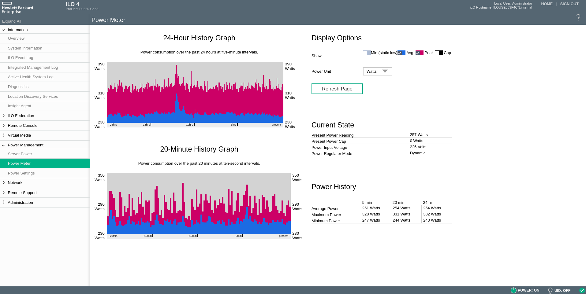
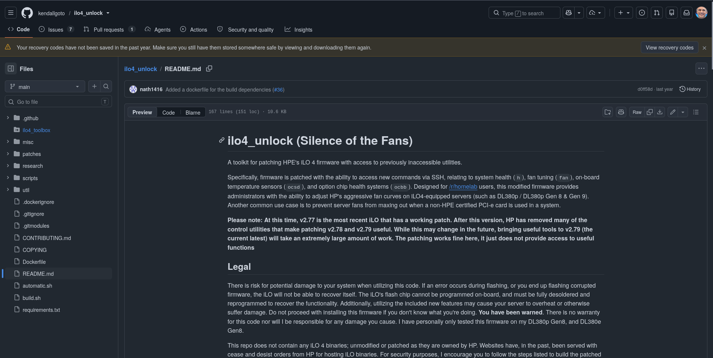
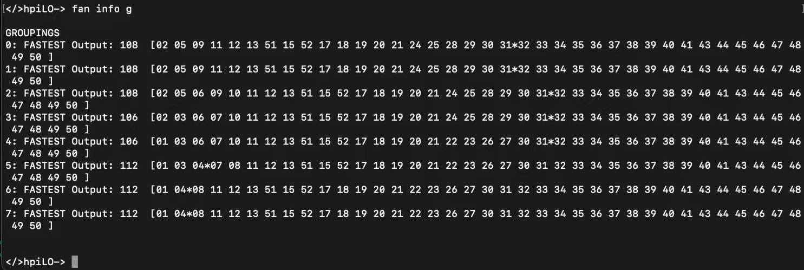
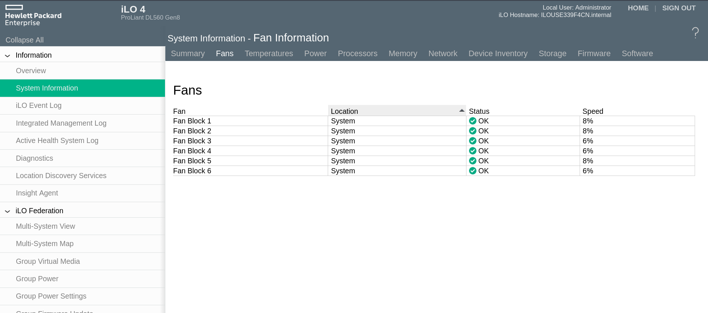

TL;DR: server fans are loud. That's normal, they're built to run hot and overloaded without dying. I am not planning to run some giant AI model on mine, so there was no real reason for the fans to sit at full blast all the time. Worse, they'd ramp up hard the moment I added anything that wasn't official HP gear: extra disks, a SAS card, a GPU, whatever. HP's own firmware doesn't give you a way to just tell the fans to calm down. So I patched it. (Actually, someone else patched it, I just followed their instructions.)

## What's an iLO, Quickly

iLO (Integrated Lights-Out) is HP's baseboard management controller on their ProLiant servers. It's a separate little computer living on the motherboard, with its own network interface, that lets you manage the server remotely: power it on and off, watch boot output over a virtual console, check health sensors, all independent of whatever OS is installed. It's the same category of thing as Dell's iDRAC or Supermicro's IPMI.

Buried in there is the fan controller, the logic that reads temperature sensors and decides how fast each fan should spin. On stock firmware, that logic is completely opaque and non-configurable. You get whatever curve HP decided on, and no interface to touch it.



## Why Doesn't HP Just Let You Control the Fans?

The honest answer is that HP doesn't really want you to. These are enterprise servers, sold with support contracts, and HP's fan curves are tuned assuming HP-certified components: their own drives, their own RAID/HBA cards, their own everything. If you plug in a random SAS card or a consumer GPU, the system doesn't know how to read it, decides it might be running dangerously hot, and just floors every fan as a safe default. From HP's perspective, that's a feature, not a bug: better an unbearably loud server than a fried one under a support contract, and better to also nudge you toward buying "genuine" parts instead of a random card off eBay.

For a homelab where I'm the one deciding what's safe to run, though, that same protection is just noise.

## The Unlock

This part isn't new ground, plenty of people have gone through it before me, and I mostly followed their work rather than reinventing it. The core project is [kendallgoto/ilo4_unlock](https://github.com/kendallgoto/ilo4_unlock) on GitHub, itself building on earlier work first documented on r/homelab ([here](https://www.reddit.com/r/homelab/comments/sx3ldo/hp_ilo4_v277_unlocked_access_to_fan_controls/) and the earlier [part 2](https://www.reddit.com/r/homelab/comments/hix44v/silence_of_the_fans_pt_2_hp_ilo_4_273_now_with/)), plus [this walkthrough video](https://www.youtube.com/watch?v=Keyz-9HNr7Q) that helped a lot with the actual flashing steps.

The short version of what this project does: it patches HP's iLO4 firmware to re-enable a set of internal SSH commands for fan tuning that HP left in the firmware but disabled from general access. Once patched, you can SSH straight into the iLO and talk to the fan controller directly.



## The Annoying Part: Downgrading First

Here's where it got tedious. The patch only works reliably up through iLO firmware v2.77; HP stripped out a lot of the useful controller access starting with v2.78. My server was nowhere near that. It was already on roughly v2.82, the newest version available at the time.

HP doesn't let you jump straight from a recent version to an old one, and you can't just grab a handful of firmware files and batch-install them either. Each downgrade has to happen one version at a time, sequentially. So that's what I did: 2.82 down to 2.81, down again, and again, working backward version by version. A few versions along the way either didn't exist for my server model or got skipped for other reasons, but eventually I landed on 2.73, and from there, updating forward one more step to the patched 2.77 build finally worked.

It wasn't technically hard, just slow and repetitive. Budget for it if you're starting from a recent version yourself.

## Finding the Actual Problem Sensor

With SSH access to the fan controller working, the next step was figuring out which specific sensor was the one panicking every time I added hardware, rather than just guessing.

The fan controller exposes a couple of useful read commands for this. `fan info g` shows the global controller state, and `fan info a` shows the full table of PID-controlled sensors and how they're currently mapped to fan speed. Running through that output, comparing which sensors had an actual influence on fan speed versus which were just reporting numbers with no real effect, is how you find the one actually driving the ramp-up.



In my case, once I added a SAS controller and some extra drives outside HP's official parts list, one sensor's reported temperature jumped and stayed pinned high, and the fan controller's PID loop responded by cranking every fan tied to it. That sensor was the actual target, not the whole fan system, just the one input feeding it bad information.

## Taming It: Lowering the Ceiling, or Raising the Setpoint

There are two reasonable ways to deal with a sensor like that. What I actually used was:

```
fan pid <ID> lo 1600
```

This sets the low output limit for that sensor's PID loop, which in practice caps how fast the fans it controls are allowed to spin as a floor, keeping them well below the panicked max-speed response even while the sensor is reporting a high number.

The other approach, which someone in the community suggested and which honestly looks like the cleaner fix, is to leave the PID output alone and instead raise the sensor's setpoint, the target temperature the PID loop is trying to hold it at:

```
fan pid 50 sp 4600
```

That sets sensor 50's target to 46°C instead of whatever lower default (mine was defaulting to 36°C) was making the proportional term overreact to a perfectly normal temperature. I haven't actually switched over to this method myself, but it seems like the more correct fix: instead of clamping the output after the fact, you're just telling the PID loop what "normal" actually looks like for that sensor given the hardware I've added, so it stops overreacting in the first place.

## Making It Stick

The one annoying catch: none of this persists. The iLO doesn't remember custom PID settings across a reboot, so every time the server restarts, it's back to stock behavior until you reapply the fix.

The fix for that is just a small script that runs at boot and reapplies every setting over SSH:

```bash
#!/bin/bash
ILO_USER="Administrator"
ILO_HOST="10.0.50.32"
SSH_KEY="/root/.ssh/ilo_rsa"

run_ilo() {
  ssh -i $SSH_KEY \
    -o StrictHostKeyChecking=no \
    -o HostKeyAlgorithms=+ssh-rsa \
    -o PubkeyAcceptedKeyTypes=+ssh-rsa \
    -o KexAlgorithms=+diffie-hellman-group14-sha1 \
    -o Ciphers=+aes128-cbc \
    ${ILO_USER}@${ILO_HOST} "$1"
}

for pid in 41 42 56 57 58 59; do
  run_ilo "fan pid $pid lo 1600"
  sleep 1
done

# after adding a 1Gb NIC in another slot
for pid in 43 60 61; do
  run_ilo "fan pid $pid lo 1600"
done
```

<!-- photo: terminal running the fan control script against the iLO -->

The extra SSH options (`HostKeyAlgorithms`, `KexAlgorithms`, `Ciphers`) are there because iLO4's SSH server is old enough that modern OpenSSH clients refuse to talk to it by default without explicitly re-enabling legacy algorithms it still relies on.

I run this once at server boot, and every card I've added since (the extra NIC noted in the script, the SAS controller, and so on) just gets its own PID entry appended to the list. It's not elegant, but it's a five-line loop, and it means I get to decide what's an acceptable fan speed instead of HP deciding for me.

## Where It Landed

The server is dramatically quieter now, without me having to worry about it cooking itself, since I'm nowhere near actually overloading it. If I ever do end up dropping something genuinely hot into it, I can just pull the script and let the stock curve take back over. For now, though, it's nice to add hardware without the whole room sounding like a jet engine spinning up.

