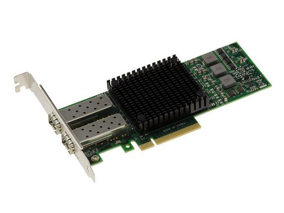
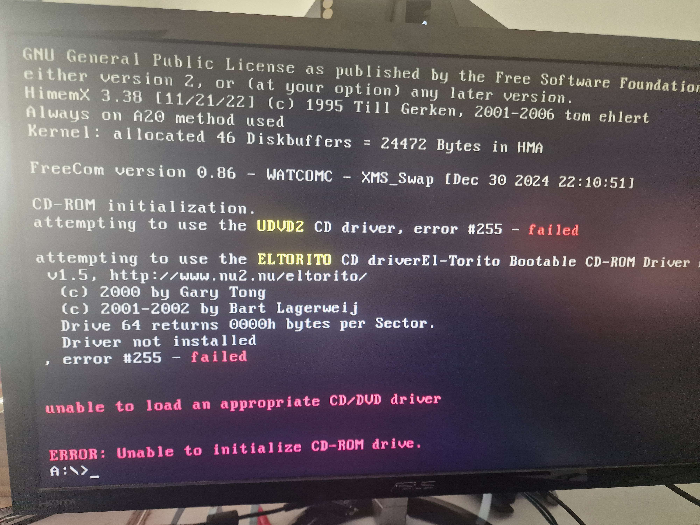

In my [last post](/posts/router/router) about ditching my ISP router and running my own GPON stick straight into my server, I mentioned I had to force the link down to 1Gbps because my NIC didn't support auto-negotiation between speeds. I said I'd come back to it once I actually got 2.5Gbps working. This is that post.

Fair warning going in: some of what follows is probably not 100% textbook-correct. This was a lot of trial and error against a chipset with very little modern documentation, and I'm writing down what I did and what actually worked, not a guaranteed step-by-step for anyone else's exact setup.

## The Goal



The card in question is a Broadcom SFP+ NIC, specifically the **BCM57810S** chipset, sitting in an HP DL560 G8 ProLiant server running Proxmox VE. The GPON stick (Huawei MA5671A, custom Carlito firmware) plugs directly into that SFP+ port.

The target was simple to state and annoying to achieve: get the link running at 2.5Gbps over HSGMII instead of the forced 1Gbps I'd settled for previously, without breaking the setup or ending up with hardware negotiation mismatches and buffer drops. I was already getting solid gigabit numbers, somewhere around 900+ Mbps down and up, but the card and the stick both support more than that, so it felt like leaving performance on the table.


## What Didn't Work

Before getting anywhere near a working setup, I burned a fair amount of time on approaches that seemed reasonable on paper and turned out to be dead ends.

**Attempt 1: FreeDOS through iLO virtual media.**

The traditional way to touch these low-level Broadcom settings is Broadcom's own Engineering Diagnostics tool, `ediag.exe`, which only ships as a legacy DOS executable. So the plan was to boot FreeDOS through HP iLO's virtual media and run it from there. I built a FreeDOS image containing the `NX2_EV` diagnostics folder and mapped it in through iLO's Removable Media.

It didn't work. iLO's Removable Media slot emulates an old floppy drive, but the image I'd built had a proper hard drive layout with an MBR and FAT32 partitions, which a floppy emulation layer has no way to parse correctly. The drives I expected to see, `C:`, `D:`, and `R:`, simply didn't mount. All I got was `A:` and `B:`, with nothing but a handful of basic FreeDOS boot files on them.



**Attempt 2: Mapping a physical USB drive through iLO instead.**

Next I tried skipping the ISO entirely and mapping a real USB drive from my Windows machine directly through iLO's Integrated Remote Console, running as Administrator, as a "Removable Drive."

Also a dead end. Legacy DOS USB and CD-ROM drivers kept failing to initialize over iLO's virtual bus, throwing "Invalid Drive" errors and repeatedly crashing the driver stack.

**Attempt 3: Skip DOS, go straight to UEFI.**

At that point I gave up on DOS as a boot environment and tried running the diagnostic tool directly from the HP server's built-in UEFI shell instead.

This one failed for a much simpler reason: the Broadcom package I had only included the 16-bit DOS binary, `ediag.exe`. There was no 64-bit UEFI equivalent (`ediag.efi`) anywhere in it. UEFI has no way to run a 16-bit DOS executable, so this was a non-starter from the beginning.

## What Actually Worked

The breakthrough, once I actually pieced it back together, was a lot dumber than I expected: the FreeDOS image I'd built the first few times around was just wrong. I'd been using a version that didn't cooperate with iLO's virtual floppy emulation at all, which is why nothing would mount properly. After digging around a bit more, I found a different, more minimal FreeDOS build on GitHub, one clearly put together by someone who'd hit the exact same wall before, and that one booted cleanly through iLO without any of the drive-mounting nonsense from before.

Before even touching FreeDOS, though, there's a bit of prep that has to happen on the Proxmox side first. The Broadcom SFP+ port needs to not be claimed by anything, no bridge, no VM passthrough, nothing actively using it, since `ediag` needs to talk to the card directly at a level no OS driver should be sitting on top of. So step one was stopping/unconfiguring whatever was using `eno2` in Proxmox and rebooting into the FreeDOS image through iLO virtual media.

Once I was actually sitting at a FreeDOS prompt that worked, the process was to run Broadcom's Engineering Diagnostics tool in engineering mode:

```
ediag.exe -b10eng
```

From there, the actual unlock happens inside the tool's own command shell, working against the card's NVM configuration directly:

```
device 1
nvm cfg
7
35=70
36=70
56=6
59=6
save
exit
```

`device 1` selects the port I was going to plug the GPON stick into. `nvm cfg` drops into the NVM config menu, and option `7` gets to the link-speed-related settings. The two lines that actually matter are `35=70` and `36=70`: 70 in hex is a mask combining 1G (0x10), 2.5G (0x20), and 10G (0x40) into one value, which is what tells the firmware "these are the speeds you're now allowed to advertise and negotiate," instead of just the stock 1G/10G pairing. `56=6` and `59=6` then set the default link speed to 2.5G specifically, rather than defaulting up to 10G, since I wanted the port talking to the GPON stick to sit at 2.5G by default rather than trying 10G and falling back. `save` writes it, and `exit` gets out of `ediag` cleanly.

<!-- photo: FreeDOS booted via iLO, sitting at the ediag prompt -->

I ran the same sequence a second time afterward, just re-entering `nvm cfg` and `7` without changing anything, purely to read back the values and confirm `35`, `36`, `56`, and `59` had actually saved the way I expected. Cheap insurance against having bricked something for nothing.

With that done, I rebooted back out of FreeDOS and iLO virtual media entirely, brought the interface back up in Proxmox, and reconfigured `eno2` the way it was before. The last step was just confirming the card would actually take a 2.5G link now instead of silently falling back, which meant checking the negotiated speed from the Proxmox host itself once the GPON stick was plugged back in.

<!-- photo: link status showing 2.5Gbps, from ethtool or the card's own status output, run from Proxmox -->

Worth saying plainly: none of the DOS/iLO/UEFI struggle from before was wasted effort exactly, it just turned out the actual blocker the whole time was a bad FreeDOS image, not some fundamental incompatibility with the approach. Once the boot environment itself was solid, the eDiag steps that unlock 2.5G on this chipset are well documented if you know where to look, and take a few minutes once you're actually sitting at a working prompt.

## Where It's At Now

The link is running at 2.5Gbps between the GPON stick and the Broadcom card, which is the actual goal of this whole detour. Functionally, I'm getting the exact same throughput I was already getting at 1Gbps, since my connection tops out well under a full gigabit anyway, so this wasn't really about squeezing out more real-world speed. It's more that I can now say my server's NIC negotiates at 2.5Gbps instead of 1Gbps, which is a nice little bragging point for the homelab even if it doesn't change much day to day.

If you're chasing the same thing on a BCM57810S or a similar Broadcom chipset: don't assume the standard FreeDOS boot image is going to just work through iLO virtual media, mine didn't for a couple of tries. If yours doesn't either, it's worth hunting for an alternate FreeDOS build before assuming the whole approach is dead. Once you're actually sitting at a working `ediag` prompt, the NVM config changes themselves are quick and well documented. It would have saved me a lot of wasted evenings if I'd realized that sooner.