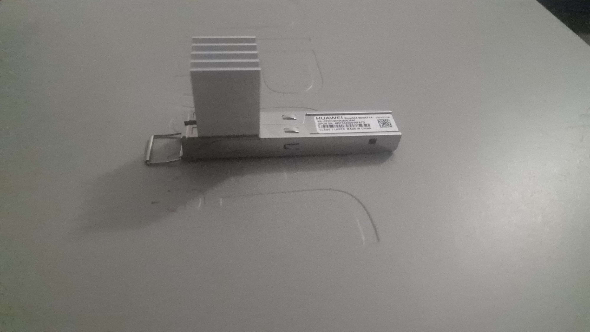
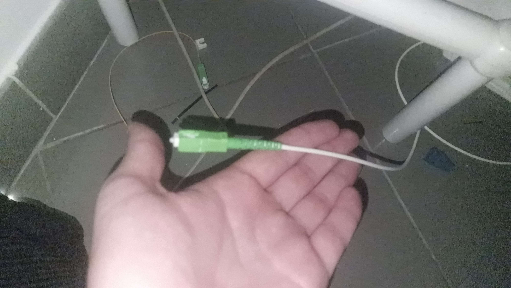
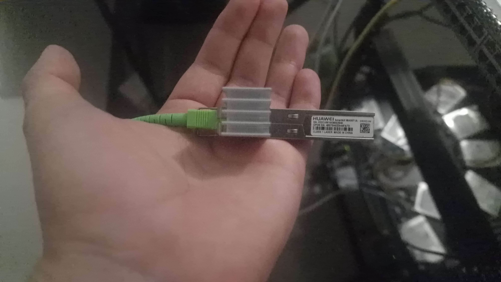
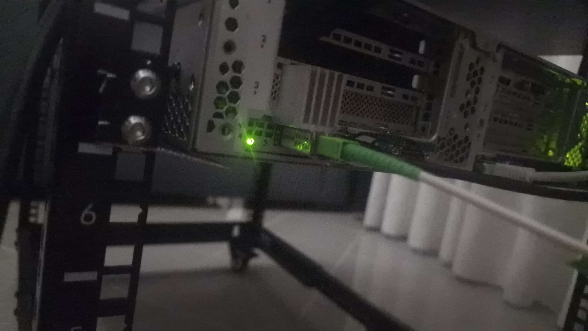
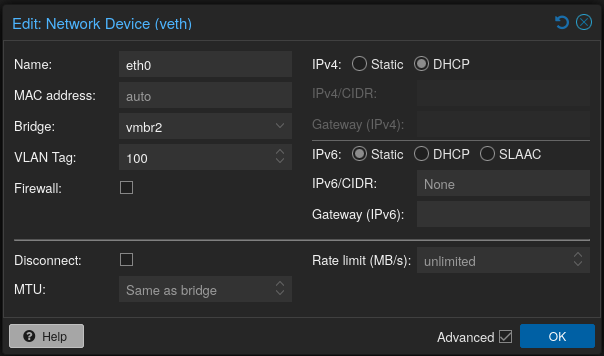
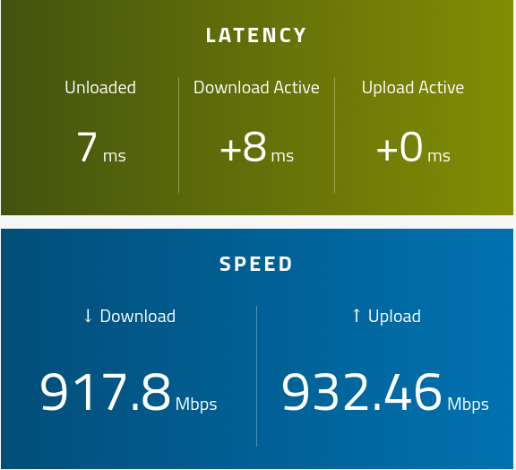

I won't name my ISP here, for reasons that should be obvious. That said, in Portugal there are really only 4 main ISPs offering fiber, so if you're curious enough to try this yourself, it shouldn't take much searching to figure out which one this post is about, and whether the same approach applies to it.

The short version of why I bothered: the ISP router sucks. It's slow, it's locked down, and it fights you on anything beyond the basics. I'm now running OPNsense as my router instead, and it's been genuinely great.

## The Hardware



The trick to getting off the ISP's router entirely, at least for GPON connections, is to stop using their ONT (the box that terminates the fiber) and replace it with your own, one you can fully control. I picked up a **Huawei MA5671A**, a GPON SFP stick that plugs directly into a normal SFP port on a switch, NIC, or router.

Getting one of these rooted and running custom firmware took a couple of attempts on my end, including bricking one along the way. That's a whole story on its own, and I've written about it in a previous post if you want the details.

For anyone actually attempting this, [hack-gpon.org](https://hack-gpon.org/ont-huawei-ma5671a/) is by far the best resource out there. It covers the MA5671A in detail, and I ended up running **Carlito firmware** on mine, which the site also documents well.

## Getting the Stick Talking to My ISP's Network

Once the MA5671A had the firmware I wanted on it, the next step was making my ISP's OLT (the equipment on their end) actually accept it as a legitimate device. This comes down to matching three pieces of identification that the ONT normally reports automatically, but that you now have to set yourself:

**Serial Number (SN).** This one's easy. It's printed on a label on your ISP's original router, so you just copy it over.

**Vendor ID.** This is just the brand of the original router. I won't say which one here, since combined with other details it could point back to the ISP, but it's the kind of thing that's visible on the router itself or in its web UI.

**PLOAM password.** This is the hard part, and worth explaining if you haven't run into it before. PLOAM stands for Physical Layer Operations, Administration, and Maintenance, and it's part of the GPON protocol used for the low-level exchange between the ONT and the OLT before your connection is even considered "up." During registration, the OLT works through a sequence of states, and at one point (state O5, specifically) it asks the ONT for a password. If the ONT doesn't answer with the right one, the OLT never lets it fully online.

As far as I know, there's no clever trick to derive this value. The only real way to get it is to ask. I got lucky. When the technician came to install my line, I just asked for it directly, and he gave it to me without any pushback.

With SN, Vendor ID, and PLOAM all set correctly, which most GPON stick web UIs let you configure directly, I flipped it over and got **O5 (connected)** on the stick's status page. That's the state that confirms the OLT has accepted the device and it's fully online.





## Wiring It Into the Server



The NIC on my server only does 1Gbps or 10Gbps, with no auto-negotiation in between, so I had to manually force the GPON stick's SGMII mode to 4 (1Gbps, no autoneg) to get a stable link. There's apparently a way to get 2.5Gbps working here too, which I've read about but haven't tried yet. That's a topic for a future post once I've actually tested it.

(Just to be clear, this won't magically make your ISP line faster, it just lets you use the full speed of the GPON stick if your ISP actually provides it.)

On the server side, this is just a network interface I bring up and bridge into OPNsense. Here's the config, cleaned up:

```
auto eno2
iface eno2 inet manual
    post-up /sbin/ethtool -s eno2 speed 1000 duplex full autoneg off
    post-up /sbin/ethtool -A eno2 rx on

# WAN
auto vmbr2
iface vmbr2 inet static
    address 192.168.1.32/24
    bridge-ports eno2
    bridge-stp off
    bridge-fd 0
    bridge-vlan-aware yes
    bridge-vids 2-4094
```

The bridge has to be VLAN-aware, because the fiber line carries multiple VLANs at once: internet, VoIP, and IPTV all share the same physical connection. I'd rather not manage VLAN filtering on the GPON stick itself. It should just do its one job, passing everything through, and let something smarter downstream decide what to do with each VLAN.

## Handing It to OPNsense

My router is currently a VM, not a physical server, so the last step is passing this interface through to the VM with VLAN 100 tagged on it, since that's the VLAN my ISP uses for plain internet traffic. The bridge itself passes all VLANs, but right now I only care about managing the internet one.



Once that's done, OPNsense sees the WAN interface come up and grabs the public IP directly, no NAT layer from the ISP's box in between. From there, I have full control over my own network: real firewall rules, no ISP-imposed port blocking, no forced NAT, none of the usual restrictions that come baked into a stock ISP router.

## Did It Actually Work?

The real test, obviously, is whether the connection performs the way it's supposed to once the ISP's router is completely out of the picture. So I ran a speedtest straight from a machine on the LAN, through OPNsense, out over the GPON stick.



Almost a full 1000/1000, right around what I'd expect on this plan. No throttling, no weirdness introduced by any of the custom firmware or the manual VLAN setup, just the connection performing exactly as it should, minus the ISP's box getting in the way.

That's the whole setup. If you're on GPON and tired of your ISP's router, it's very likely doable on your line too. The specifics of SN, vendor ID, and PLOAM will differ, but the overall approach is the same everywhere.